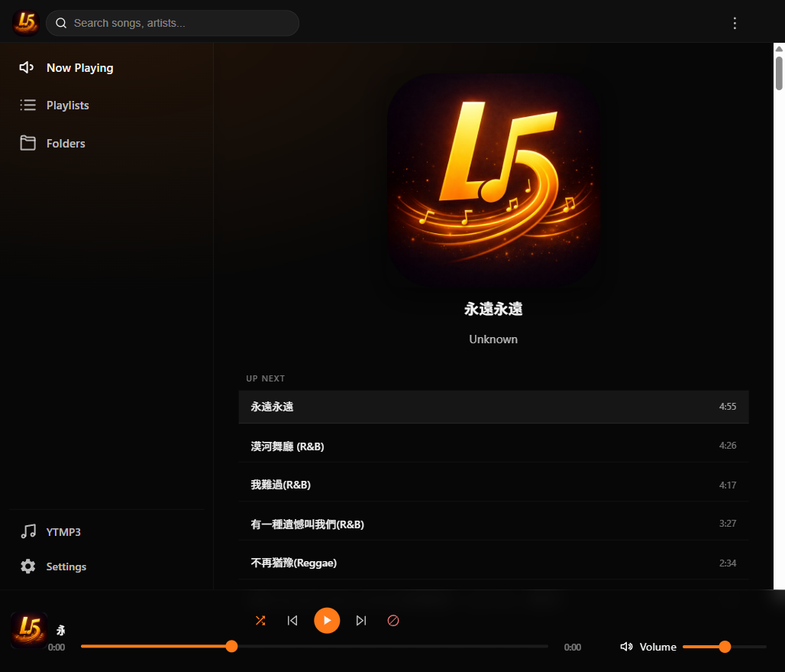
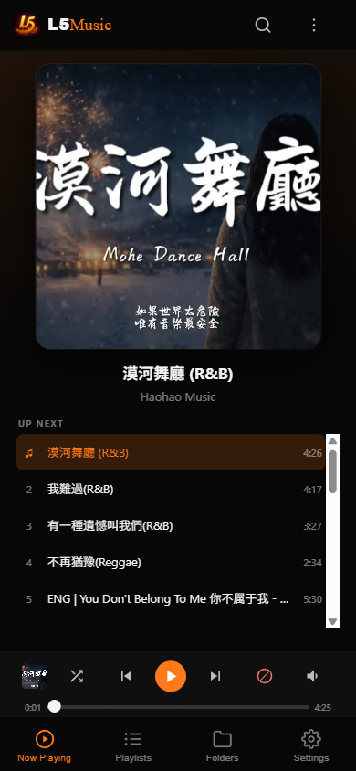
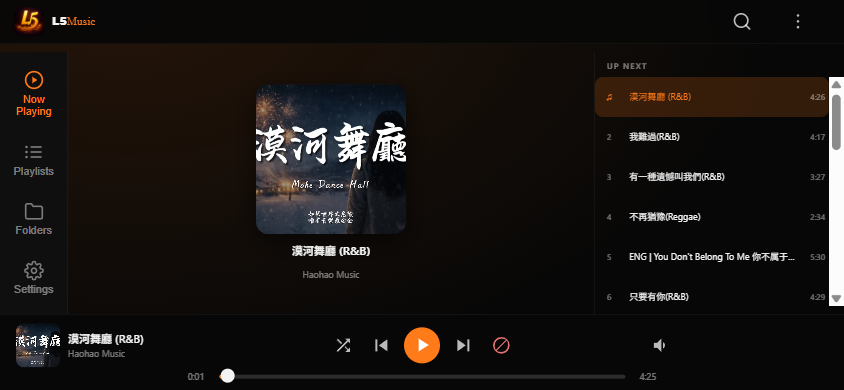

<p align="center">
  
</p>

<h1 align="center">L5Music</h1>

<p align="center">
  <strong>Self-hosted music streaming PWA for Raspberry Pi</strong><br>
  Stream your own music library from home — desktop, Android, and iOS.
</p>

<p align="center">
  
  
  
</p>

---

## Screenshots

| Desktop | Mobile Portrait | Mobile Landscape |
|---------|----------------|-----------------|
|  |  |  |

---

## 🚀 Quick Start

> **One command to install everything on your Pi:**

```bash
git clone https://github.com/L5Diy/L5Music.git
cd L5Music
chmod +x install.sh && ./install.sh
```

The installer will walk you through setting up the backend and frontend. Pick option **1** for a full install — you'll be streaming in minutes.

> **Already have Node.js and nginx?** Run the scripts individually:
> ```bash
> ./install-server.sh    # Backend only
> ./install-frontend.sh  # Frontend only
> ./setup-domain.sh      # Optional: HTTPS + custom domain
> ```

---

## Features

| Feature | Description |
|---------|-------------|
| **Fair Shuffle** | Every song plays once before any repeat. Blocked songs are excluded. Cycle resets automatically. |
| **Block Songs** | One-tap block from the player. Manage blocked songs under Folders → Blocked. |
| **Playlists** | Create, rename, delete, drag-to-reorder. Generate random playlists instantly. |
| **YTMP3 Downloader** | Paste a YouTube URL → MP3 in your library. Choose which folder to save to. |
| **Music Mode** | Create any subfolder in your music directory and it appears as a mode automatically. |
| **Themes** | 6 accent colors × 4 backgrounds. Changes apply instantly, saved per device. |
| **Cross-Device Sync** | Playlists, blocked songs, and shuffle progress sync via WebSocket in real time. |
| **Admin Dashboard** | Manage users, approve signups, reset passwords, lock accounts, delete songs. |
| **PWA** | Installable on Android and iOS home screens. Works offline for cached content. |

---

## Requirements

- Raspberry Pi (or any Linux machine) with a Debian-based OS
- Node.js 18+
- nginx
- A folder of music files (mp3, flac, m4a, ogg, wav, etc.)

---

## Manual Setup

<details>
<summary><strong>Backend</strong></summary>

```bash
cd backend
cp .env.example .env
nano .env              # Set your music folder path, port, etc.
npm install
npm install -g pm2
pm2 start server.js --name l5music-core
pm2 save && pm2 startup
```

</details>

<details>
<summary><strong>Frontend (nginx)</strong></summary>

Copy `frontend/` to your web server root and configure nginx:

```nginx
server {
    listen 80;
    server_name _;
    root /var/www/l5music;
    index index.html;

    location = /sw.js {
        alias /var/www/l5music/sw.js;
        add_header Cache-Control "no-store, no-cache, must-revalidate";
    }

    location /l5/ws {
        proxy_pass http://127.0.0.1:3002/ws;
        proxy_http_version 1.1;
        proxy_set_header Upgrade $http_upgrade;
        proxy_set_header Connection "upgrade";
        proxy_read_timeout 86400;
    }

    location /l5/ {
        proxy_pass http://127.0.0.1:3002/;
    }

    location /blocked {
        proxy_pass http://127.0.0.1:3002/blocked;
    }

    location /shuffle-log {
        proxy_pass http://127.0.0.1:3002/shuffle-log;
    }

    location /send-report {
        proxy_pass http://127.0.0.1:3002/send-report;
    }

    location / {
        try_files $uri $uri/ /index.html;
    }
}
```

</details>

<details>
<summary><strong>First Login</strong></summary>

On first run the backend creates a default admin account. Check the PM2 logs for credentials:

```bash
pm2 logs l5music-core
```

</details>

---

## Environment Variables

| Variable | Required | Default | Description |
|----------|----------|---------|-------------|
| `PORT` | No | `3002` | Backend API port |
| `MUSIC_DIR` | **Yes** | `/home/pi/music` | Path to your music folder |
| `DOMAIN` | No | `localhost` | Your domain (for email links) |
| `GMAIL_USER` | No | — | Gmail for signup notifications |
| `GMAIL_PASS` | No | — | Gmail app password |

---

## Project Structure

```
L5Music/
├── backend/
│   ├── server.js        # Express + WebSocket API
│   ├── package.json     # Dependencies
│   └── .env.example     # Config template
├── frontend/
│   ├── index.html       # App shell
│   ├── app.js           # Core app logic
│   ├── styles.css       # Styles
│   └── assets/          # Icons and logos
├── install.sh           # All-in-one installer
├── install-server.sh    # Backend installer
├── install-frontend.sh  # Frontend installer
├── setup-domain.sh      # HTTPS + domain setup
└── README.md
```

---

## Acknowledgments

[yt-dlp](https://github.com/yt-dlp/yt-dlp) · [Express](https://expressjs.com/) · [PM2](https://pm2.keymetrics.io/) · [music-metadata](https://github.com/borewit/music-metadata) · [bcrypt](https://github.com/kelektiv/node.bcrypt.js) · [ws](https://github.com/websockets/ws) · [Helmet](https://helmetjs.github.io/) · [Nodemailer](https://nodemailer.com/) · [nginx](https://nginx.org/) · [Let's Encrypt](https://letsencrypt.org/)

---

<p align="center">MIT License © 2026 L5Diy</p>


---

## Known Limitations

### iOS PWA Lock Screen Controls

On iOS 26+ standalone PWAs, lock screen media controls do not respond. Apple suspends the PWA JS context when backgrounded.

**Works:** Background audio plays, lock screen shows song info and cover art, Android works fully.

**Broken:** Tapping play/pause/next/prev on iOS lock screen does nothing. Applies to both Safari and Chrome installed PWAs.

**Workaround:** Use L5Music in a browser tab instead of the installed PWA — lock screen controls work in tabs.

Tracked at [webkit.org/b/198277](https://bugs.webkit.org/show_bug.cgi?id=198277).
